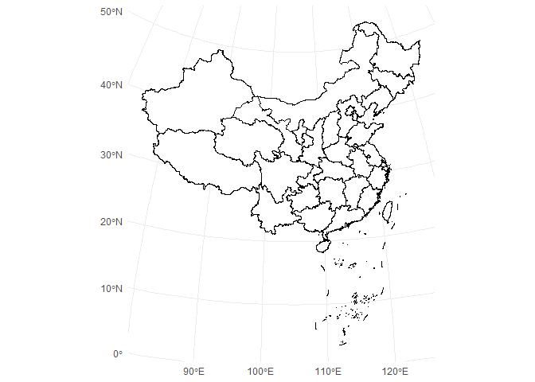
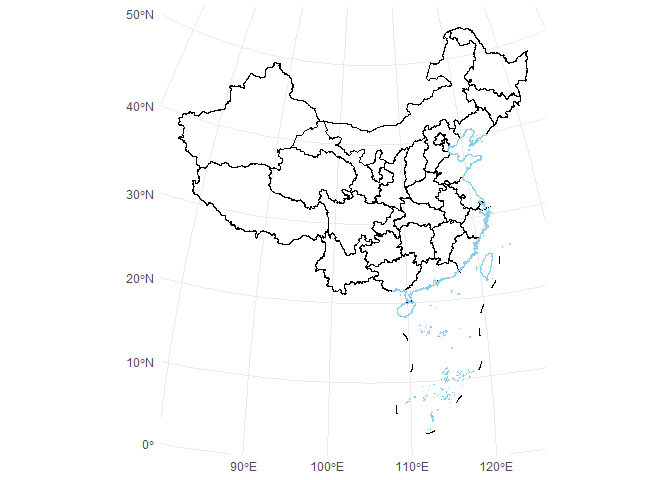
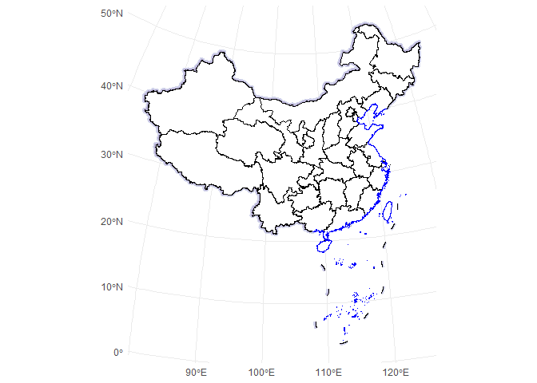

<!-- README.md is generated from README.Rmd. Please edit that file -->

# ggmapcn

<!-- badges: start -->
<!-- badges: end -->

`ggmapcn` is a `ggplot2` extension package for visualizing China’s map
with customizable projections and styling. This package includes
province-level map data and supports adding mainland borders,
coastlines, and buffer areas, making it easy to create geographic
visualizations of China.

# Installation

Install the development version of ggmapcn from GitHub with:

``` r
# install.packages("devtools")
devtools::install_github("Rimagination/ggmapcn", force = TRUE)
```

# Usage

## Plotting a Map of China

To plot a map of China with province boundaries, use `geom_mapcn()`:

``` r
library(ggplot2)
library(ggmapcn)

ggplot() +
  geom_mapcn() +
  theme_minimal()
```



## Custom Projection and Styling

If you want to try the Albers projection, you can customize it.

``` r
ggplot() +
  geom_mapcn(crs = "+proj=aea +lat_1=25 +lat_2=47 +lat_0=0 +lon_0=105 +x_0=0 +y_0=0 +datum=WGS84 +units=m +no_defs", color = "black", fill = "white", size = 0.7) +
  theme_minimal()
```


## Adding Mainland Borders and Coastlines

Use `geom_boundary_cn()` to add mainland borders and coastlines to the
map. You can set colors and line widths for both the mainland and
coastline boundaries:

``` r
ggplot() +
  geom_mapcn(fill = NA) +
  geom_boundary_cn(
    mainland_color = "black",
    mainland_size = 0.5,
    coastline_color = "skyblue",
    coastline_size = 0.5
  ) +
  theme_minimal()
```



## Adding Buffer Zones

The `geom_buffer_cn()` function adds buffer zones around China’s
borders. You can specify buffer distances, colors, and projections. The
example below shows buffer zones with varying distances:

``` r
ggplot() +
  geom_buffer_cn(mainland_dist = 40000) +
  geom_buffer_cn(mainland_dist = 20000, fill = "#BBB3D8") +
  geom_mapcn(fill = "white") +
  geom_boundary_cn() +
  theme_minimal()
```



## Data Source

The data used in this package is sourced from Tianditu
(<https://cloudcenter.tianditu.gov.cn/administrativeDivision/>), a
reliable provider of province-, city-, and county-level boundary
information in China. This administrative division data has been
processed into GeoJSON format for seamless integration into the package,
enabling easy access and visualization.
