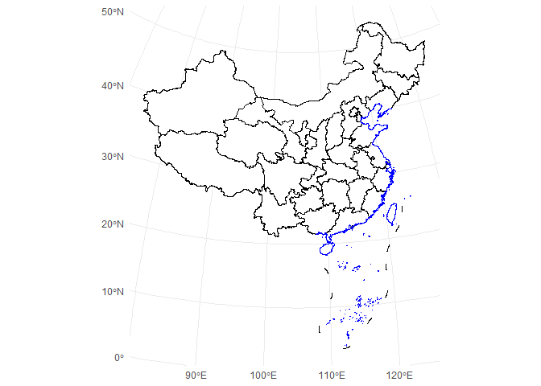
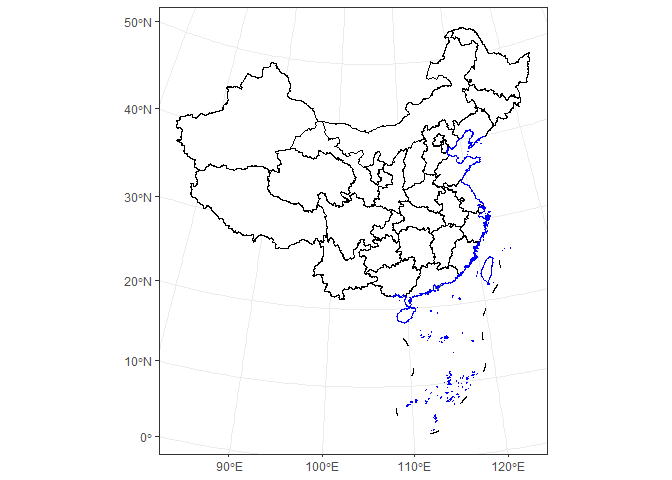
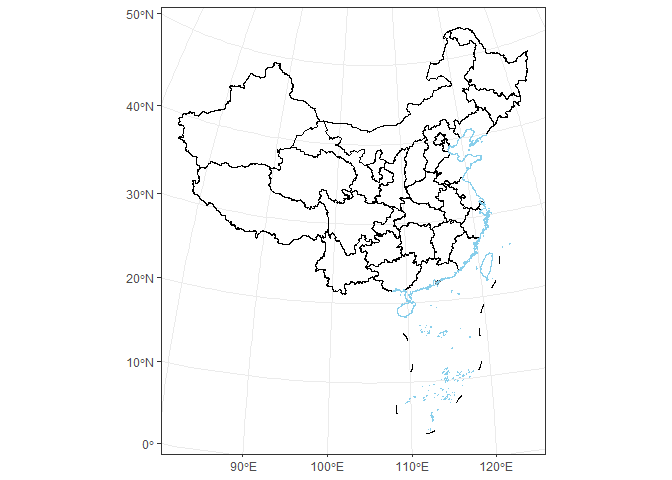
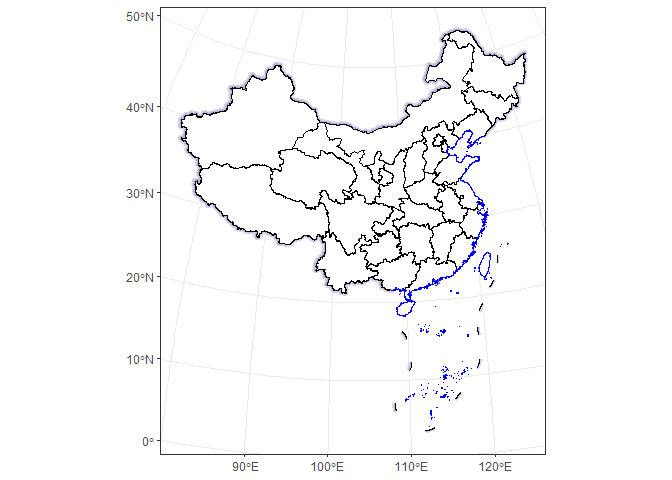
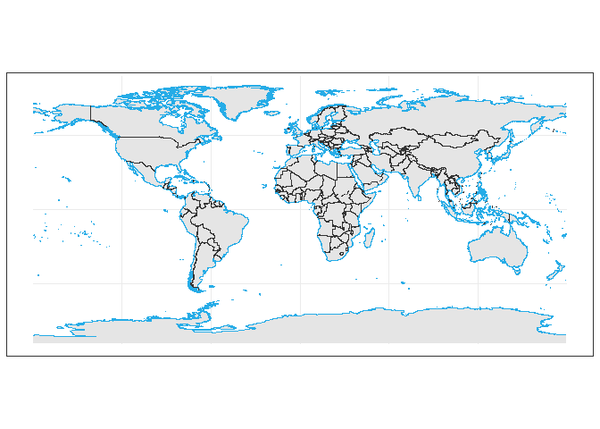

<!-- README.md is generated from README.Rmd. Please edit this file -->

# ggmapcn

`ggmapcn` is a `ggplot2` extension package for visualizing maps of China
and the world with customizable projections and cartographic styling.

Because CRAN imposes strict size limits on package data, certain large
geospatial datasets used by `ggmapcn` cannot be bundled directly. These
datasets are stored externally and retrieved automatically using
`check_geodata()`. All high-level functions—such as `geom_mapcn()` and
`geom_world()`—internally call `check_geodata()` to ensure that required
data files exist locally.

If the network is unavailable or remote mirrors cannot be reached,
`check_geodata()` fails gracefully by returning `NA` paths. This
behavior is fully compliant with CRAN’s policy for optional network
resources.

------------------------------------------------------------------------

## Installation

Install the development version from GitHub:

``` r
# install.packages("devtools")
devtools::install_github("Rimagination/ggmapcn", force = TRUE)
```

------------------------------------------------------------------------

# Data Management with `check_geodata()`

Several datasets—such as `world_countries.rda`, `China_sheng.rda`, and
`gebco_2024_China.tif`—are hosted externally.  
`check_geodata()` automatically:

- searches for existing files in:
  - user-specified `local_dirs`
  - the package `extdata` directory
  - the per-user cache directory via
    `tools::R_user_dir("ggmapcn", "data")`
- downloads missing files from mirrors (jsDelivr and GitHub)
- verifies checksums when available
- retries on failure and supports resume capability
- returns `NA` instead of errors when mirrors cannot be reached

To check and retrieve all files:

``` r
check_geodata()
```

To retrieve explicitly the datasets used by `geom_world()`:

``` r
check_geodata(c(
  "world_countries.rda",
  "world_coastlines.rda",
  "world_boundaries.rda"
))
```

If your network cannot access `cdn.jsdelivr.net` or
`raw.githubusercontent.com`, you may manually download the files and
place them in a directory passed to `local_dirs`.

------------------------------------------------------------------------

# Usage Examples

## 1. Basic Map of China

``` r
library(ggplot2)
library(ggmapcn)

ggplot() +
  geom_mapcn() +
  geom_boundary_cn() +
  theme_minimal()
```



------------------------------------------------------------------------

## 2. Custom Projection (Albers)

``` r
ggplot() +
  geom_mapcn(
    crs = "+proj=aea +lat_1=25 +lat_2=47 +lat_0=0 +lon_0=105 +datum=WGS84",
    fill = "white",
    color = "black",
    size = 0.7
  ) +
  geom_boundary_cn() +
  theme_bw()
```



------------------------------------------------------------------------

## 3. Adding Mainland Borders and Coastlines

``` r
ggplot() +
  geom_mapcn(fill = NA) +
  geom_boundary_cn(
    mainland_color = "black",
    mainland_size = 0.5,
    coastline_color = "skyblue",
    coastline_size = 0.5
  ) +
  theme_bw()
```



------------------------------------------------------------------------

## 4. Buffer Zones

``` r
ggplot() +
  geom_buffer_cn(mainland_dist = 40000) +
  geom_buffer_cn(mainland_dist = 20000, fill = "#BBB3D8") +
  geom_mapcn(fill = "white") +
  geom_boundary_cn() +
  theme_bw()
#> Warning: attribute variables are assumed to be spatially constant throughout
#> all geometries
#> Warning: attribute variables are assumed to be spatially constant throughout
#> all geometries
```



------------------------------------------------------------------------

## 5. World Map (WGS84)

``` r
ggplot() +
  geom_world(show_ocean = FALSE) +
  theme_bw()
#> Warning: geom_world() has been redesigned; its interface and defaults have
#> changed compared to earlier development versions. See ?geom_world for details.
```



------------------------------------------------------------------------

# Data Sources

## China administrative boundaries

Provided by **Tianditu**  
<https://cloudcenter.tianditu.gov.cn/administrativeDivision/>

Province-, prefecture-, and county-level boundaries are preprocessed and
simplified for efficient rendering in `ggplot2`.

## Global administrative boundaries

The global dataset (countries, coastlines, and political boundaries) is
curated and maintained by the package authors. It is optimized for
consistent cartographic outputs across world projections and supports
antimeridian splitting.

------------------------------------------------------------------------

# Learn More

See the Articles for tutorials on:

- global projections and antimeridian handling  
- elevation and raster overlays  
- vegetation and environmental data  
- styling world and China maps  
- regional vs. global map workflows

------------------------------------------------------------------------
